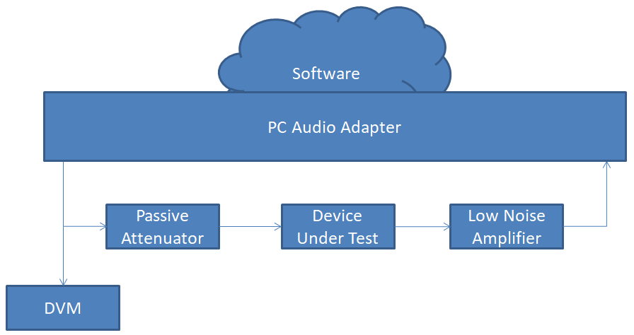
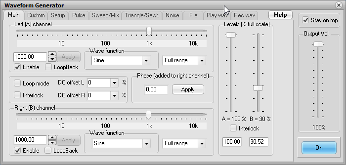
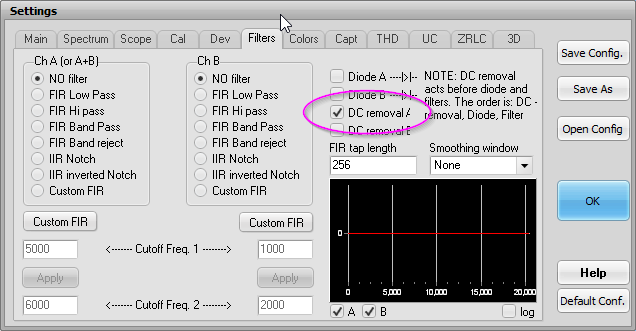
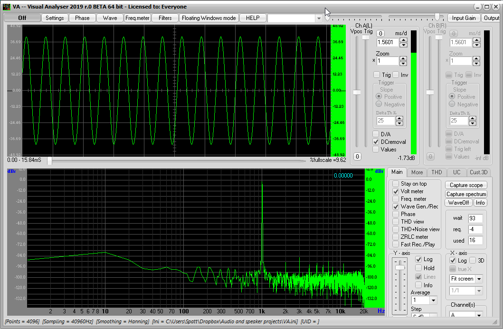
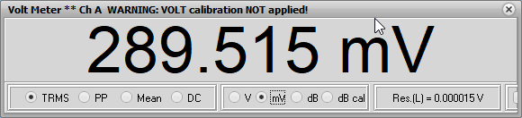

# Measuring electronic noise with PC audio hardware

Francis Deck, 1/2/2023

In this article, I work through how I measure low level electronic noise using a PC audio interface, free software, and a bit of add-on hardware. My main goal is to confirm the theoretical noise of simple audio circuits that use high performance op-amp chips. 

My preferred op amp, the OPA1654, has a rated input voltage noise density of 4.5 $nV/{\sqrt{Hz}}$ (abbreviated nV/rtHz). The measurement apparatus needs to have a lower noise floor, so it doesn't contribute to the overall noise measurement. The noise floor can be subtracted, but at the expense of the accuracy of your final result.

This article is offered in the spirit of old fashioned scientific papers, where experiments were expected to be reproducible with effort by somoene who could fill in gaps and solve minor problems as needed. It's hopefully good enough for beginners to understand but not necessarily to reproduce on their own.

## Warnings

The audio hardware used in this article is not approved for use as general purose electronic test equipment. Do not attempt to replicate this test unless you are a qualified technician or engineer. There's a chance that the test, if set up improperly, could damage your hardware.

## Can it be done?

There are two problems with using PC audio hardware for performing this measurement:

1. Its voltage scale is un-calibrated, and my only source of voltage calibration is a digital multimeter (DMM).

2. It does not have a low enough noise level, by itself, due to quantization noise.

To understand the quantization noise problem, imagine that the audio adapter has (for sake of argument) 16 bit resolution and an input range of 1 V. A single analog-to-digital unit (ADU) is equal to a part in 2^16 of 1 V, or about 1.5 uV. Dividing by the square root of the bandwith, nominally 20 kHz, gives an expected noise density of about 110 nV/rtHz. This is way above the noise floor that we need, which is a couple nV/rtHz.

To make a noise measurement at a low level, the audio signal needs to be amplified, with enough gain that the amplifier itself becomes the dominant noise source.

My solution is to build an audio attenuator, and an amplifier, using low noise techniques, that can be inserted into the signal chain of a USB audio interface. The attenuator and amplifier adapt the audio interface to the very low signal levels involved in the noise measurement.

Now, before we get too excited here, make no mistake: **This measurement is hard**. It took a lot of effort, and some trial and error, to get the actual noise floor of the measurment itself down to the point where it was possible to measure the noise of an actual circuit.

## Test setup

Here's a block diagram of my test setup.

**PC audio adapter**: PreSonus AudioBox USB96, not the latest and greatest, but good enough for this work.

**Attenuator**: A passive voltage divider, that lowers the calibration voltage down to a level that does not overload the low noise amplifier. In this case, the divison ratio is about 197.

**Device under test**: This is whatever I'm trying to test. For the sake of this discussion, it's one of my audio high pass filter circuits.

**Low noise amplifier**: A hand-built amplifier based on an ultra low noise op amp chip, with a fixed gain of 197. The precise gain figure is not important. It needs enough gain so that the input noise of the amplifier, and not of the PC audio hardware, is the dominant noise source in the system.

**DMM**: A Fluke 115 digital multimeer, set to the AC Volts scale. It's important for the meter to have a True RMS function, and that it's specified to handle the frequency range used in the experiments.

**Software**: An app called Visual Analyzer (https://www.sillanumsoft.org/download.htm), that I'm mainly using as a RMS voltmeter.

## Test 1, does the setup work at all?

Run a jumper cable from the main Line output to Line In on the audio adapter. Only one channel is needed. I'll use Channel 1 (left). Run Visual Analyzer. Generate a 1 kHz sine tone, see if it can be read in the waveform display at a decent level. Here are typical settings for the generator:

There's one important setting for the analyzer, **DC removal A** which removes the slight DC offset that's always present in PC audio hardware. Without this setting, the RMS measurement will be inaccurate:

Clicking "ON" in the main window starts the analysis. I ran the output level of the generator up and down until the waveform was within the vertical range of the display. At this point it's possible to see that the level of harmonics in the spectral display is very low.

I've checked the "Volt meter" box, to get this display:

TRMS means True RMS, and it is equal to the satndard deviation of the input readings, so long as DC Removal is turned on. The display says it's not calibrated, and we won't worry about that. All that matters is we get a number, since we'll be applying the calibration by hand as we conduct measurements.

For the rest of the measurements, I'll be using the displays in the following way:

**Waveform display** Visually make sure the input signal is not clipped.

**Spectral display** Visually make sure there are no unexpected peaks that would suggest electrical interference. The display needs to be fairly peak-free in order to perform a good noise measurement.

**Volt Meter display** Writing down numbers from this display, that can be turned into a noise voltage result. Unless you have enabled Calibration in Visual Analyzer, assume that the units of this display are arbitrary. In practice, we'll always be using a ratio of measurements from this display, so the units won't matter.

## Test 2, checking the signal path

I'm still seeing if everything works. Now I'm going to start using the full test setup:

1. I will turn on the sine generator at 500 Hz and make sure I can read the AC voltage on my DMM. The DMM is specified to have 1% accuracy up to 500 Hz. 

2. I will make sure the waveform display is un-distorted and at a fairly high level. I've had to mess with the input and output level settings in the Windows Sound Settings dialog.

3. Using the tip of the 1/8" plug as a "probe" I will observe the signals at each connection in the system, to make sure they correspond to what I expect based on the gains of the attenuator and the low noise amplifier. I'm not trying to make an accurate noise measurement yet, just making sure nothing is broken and that everything makes sense.

## Test 3, checking the low noise amplifier

Remove the DUT from the signal path, so the attenuator is feeding the LNA directly.

With the sine generator turned on, measure the AC voltage on the DVM and the Volt Meter signal in the analysis software. If you followed my resistor choices, the input voltage at the LNA is 1/197 of the voltage on the DVM. The numbers I'm giving here are my readings from a single run of this experiment, just to give a worked-out example

	Voltage at input to attenuator: 386 mV

	Voltage at input to LNA: 386 mV / 197 = 1.96 mV

	RMS reading by Visual Analyzer: 82914 (reads as mV, but treat as dimensionless)

Turn the sine generator off. Check that there is no DC offset remaining on the DMM, and record the Volt Meter signal.

	RMS reading by Visual Analyzer: 13

	Actual RMS voltage: (1.96 mV) (13/82914) = 307 nV

	Equivalent input noise: (307 nV) / sqrt(20000 Hz) = 2.2 nV/rtHz
	
Result: I conclude that my "noise measurement system" consisting of the low noise amplifier coupled to a USB audio adapter and read by Visual Analyzer software has an equivalent input noise of a couple of nV/rtHz. This is much lower than the theoretical noise of my preamp, so I approve of the system... so far.

## Test 4, testing a device

The setup is as shown in Test 2. Because the device under test (DUT) might have gain, the voltage measurement has to be re-calibrated. I'll work through this, even though I know that my device has a gain of 1.

With generator On:

	Voltage at input to attenuator: 386 mV

	Voltage at input to LNA: 386 mV / 197 = 1.96 mV

	RMS reading by Visual Analyzer: 82630 (reads as mV, but treat as dimensionless)
	
With generator Off:

	RMS reading by Visual Analyzer: 51
	
	Actual RMS voltage: (1.96 mV) (51/82630) = 1.2 uV
	
	Equivalent input noise: (1.2 uV) / sqrt(20000 Hz) 8.7 nV/rtHz.
	
**Is this any good?** I'm testing a circuit that's using 3 sections of a National Semiconductor OPA1654 quad op amp chip. The noise spec for the '1654 is 4.5 nV/rtHz for each section. The lowest possible noise for the overall circuit is found by multiplying by sqrt(3):

	Theoretical noise: (4.5 nV/rtHz) sqrt(3) = 7.8 nV/rtHz.
	
I'm willing to say that the measured noise of my circuit is barely above the total noise contributed by the op amps, according to their specs. 

## The battle over "specs"

There's a lot of confusion and even a bit of suspicion about "specs" in the music gear business. For this reason, the more reputable gear makers tend to clarify what any particular spec means. If you say that a "spec" is X, it's assumed that every unit will pass X. Since test results can vary, the only way to guarantee a spec is to set a spec limit that's easy to pass.

I'm going to avoid giving those kinds of "specs" for an additional reason: You can see from my test report, that I don't have a proper test engineering lab. But because I'm not protecting major trade secrets, I can be open about how I do my testing. For these resaons, my "specs" work in the following way:

1. Figure out a measurement technique that works well enough that I can trust it. Publish it, so it can be critiqued if necessary.
2. While developing a product, I make frequent tests. When I launch a product, I always build several units to test my assembly process, and I also test all of them to get an idea of how much variation there is.
3. Re-test units occasionally to make sure there are no bad trends creeping into my product.

In the case of these noise tests, my main observation is that my measured noise level is *way better than it needs to be*, which is where I want to put it. I want the HPF to be quiet enough that it's unlikely to ever be the main source of noise in a system, even in a studio setup.

The main reason for such a low noise level is my choice of a high-performance op amp chip that was designed for audio use. That, and I've now got a bunch of them, so I have no reason to try another chip.