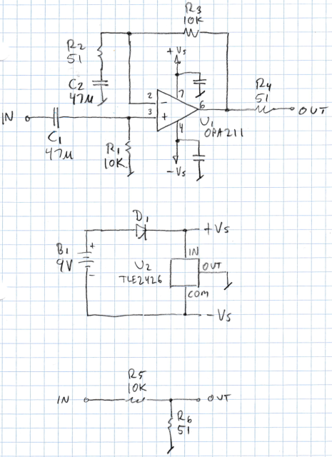
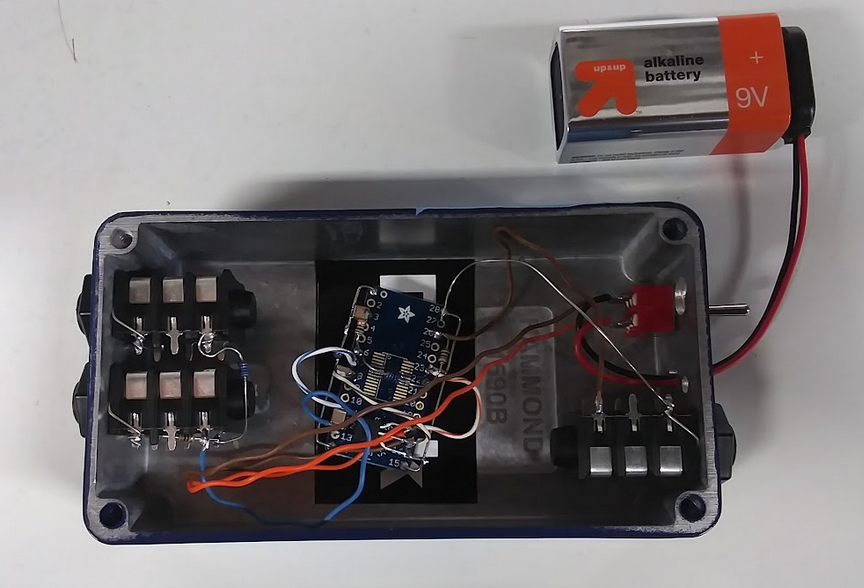

# Low Noise Test Amplifier

Francis Deck, 1/2/2023

## Purpose

Amplify an input signal by about 200x, while contributing an extremely low level of noise. This is part of my DIY electronic noise measurement setup. The input noise of this amplifier will be much lower than that of the device under test (DUT).

## Warnings

The audio hardware used in this article is not approved for use as general purose electronic test equipment. Do not attempt to replicate this test unless you are a qualified technician or engineer. There's a chance that the test, if set up improperly, could damage your hardware.

## Circuit Description

Here's the schematic:

U1 is a Texas Instruments OPA211 operational amplifier (op amp) chip, which has a rated input noise density of 1.1 nanoVolts per square root of Hz (nV/rtHz).

The circuit is wired in the textbook non-inverting gain configuration, with gain equal to (R2 + R3)/ R2 = 197. Capacitor C2 reduces the low-frequency gain with a corner frequency of 1/(2 pi R3 C2), roughly 70 Hz. A corresponding blocking capacitor on the input further reduces DC gain, with the same corner frequency. Noise below 70 Hz doesn't really contribute to the behavior of typical audio circuits. The DC paths to both inputs of the op amp are through equal 10k resistors, minimizing voltage offset due to bias current.

A 9-V battery is split into a bipolar power supply by a Texas Instruments TLE2426 "rail splitter" IC. This circuit doesn't need a lot of headroom since it will be used for measuring "nothing," and it's convenient to use just a single battery. A Shottky diode protects from battery reversal. A series resistor in the output protects against accidental short circuit.

## Test Attenuator

At some point you need an input signal of known amplitude to calibrate the noise measurement. But a voltage big enough to measure on a voltmeter will also overload the amplifier circuit. My solution is to build a trustworthy passive attenuator, to turn an easily measured signal into a very small input signal. Since I used the same resistors, the attenuation factor is equal to the gain of the amplifier, 197.

## Construction

I only need one of these, so it makes sense to build it on a breakout board. I used a board with more pins than my IC, leaving me extra pins for the passive components.

Everything goes into a small aluminum box. I have these boxes from my HPF-Pre product. If I screw up a box, it goes into my project bin. So the extra holes are from the original use.

## Theory of operation

At this point, we need to know what to expect for the performance of the circuit. The reason is that the best test of the circuit is to see if it meets its theoretical performance. The two main contributions to noise in the circuit should be the input voltage noise of 1.1 nV/rtHz, and the Johnson noise of R3. Rule of thumb: 0.128 nV/rtHz * sqrt(R) where R is in Ohms. The 51-Ohm resistor will have a Johnson noise of 0.91 nV/rtHz, so the total noise should be sqrt(1.1^2 + 0.91^2), or about 1.4 nV/rtHz. 

At the very least, we know that the measurement noise won't be *lower* than 1.4 nV/rtHz. I'll be happy with any value that's *believable* and low enough to allow further measurement of real audio circuits.

Is this good enough? The measured noise of a *system* combining this amplifier and the DUT will be based on a sum of the noise contributions from each device. What kind of sum? The rule of thumb for random noise that is roughly "flat" in the frequency domain is that the combined noise is the *quadrature sum* of the two contributions $n_{total} = \sqrt{n_1^2 + n_2^2}$. 

Because of this sum, the total noise is dominated by the larger of the contributors. For instance let's say my amplifier has a voltage noise of 1.1 nV/rtHz, and I'm testing something with about 8 nV/rtHz. The combined noise is about 8.1 nV/rtHz. 

A good rule for the low noise amplifier is that its noise level should be low enough to safely ignore, but we should make sure that's true. If it's *larger* than the noise of the DUT, then *uncertainty* in its value will spoil the measurement.

My use of this test will be with circuits based on JFET-input op amps, the quietest of which will have noise specs in the ballpark of 4 to 5 nV/rtHz. 

## Testing

Testing will be part of my procedure for noise testing.